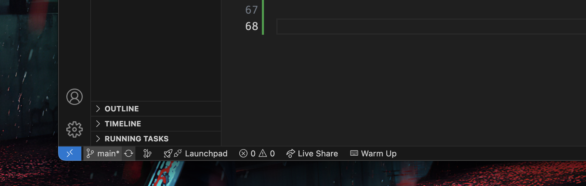
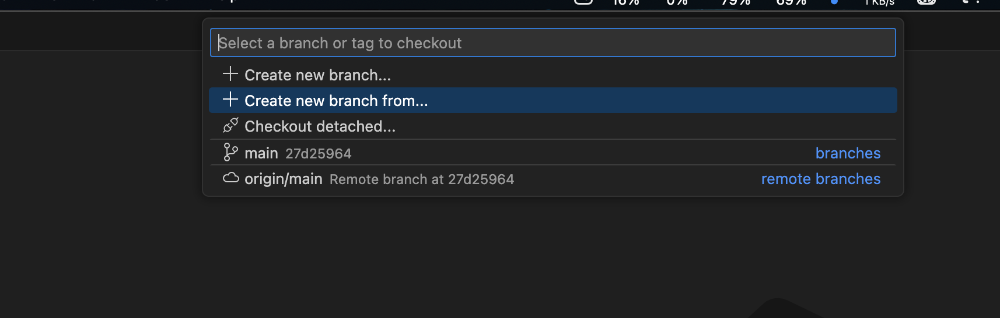
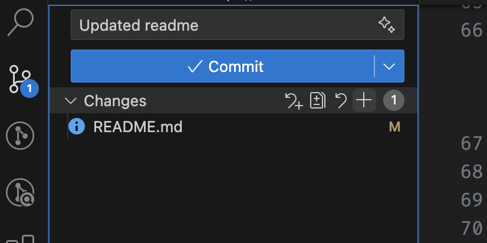

# JadaF - Just Another Data Analysis Framework


**JadaF** is a Python package designed to simplify data analysis workflows. 

## Installation

### Dependencies

JadaF requires the following Python packages:

- **matplotlib/seaborn**: For creating interactive visualizations.
- **scikit-learn**: For machine learning algorithms and data preprocessing tools.
- **polars**: A fast DataFrame library.
- **pandas**: For handling structured data and manipulation.

#### Installation for developement

To install the dependencies, you need to download the repo and use requirements.txt (it's recomended to use a separate env if developing):

```bash
git clone https://github.com/yourusername/JadaF.git@dev
cd JadaF
pip install -r requirements.txt
```

Then to install the library locally in dev mode you can run:

```bash
pip install -e .
```
This will install the library in editable mode, which means that any changes made to the source code will be reflected without needing to reinstall the package.

---

#### Normal installation

If you don't want to develop, and just use the library you can install JadaF directly from GitHub:

```bash
pip install git+https://github.com/AlessioMantovani/jada.git@main
```

## Contributing to JadaF

Thank you for considering contributing to **JadaF**! To help make the contribution process smoother, please take a moment to read and follow these guidelines.

## Table of Contents
- [How to Contribute](#how-to-contribute)
- [Branching and Pull Requests](#branching-and-pull-requests)
- [Code Style and Standards](#code-style-and-standards)
- [Testing](#testing)
- [Commit Messages](#commit-messages)

## How to Contribute

### Clone the repository

Clone the repository in dev mode like mentioned above

### **Create a branch**

To implement a feature create it's own branch to avoid creating conflicts with the **dev** and **main** branches. Create a branch from the **dev** branch, otherwise you will miss other people new implementations!

1. Click on the current branch in vscode



2. Click on 'Create new branch from' and select dev (if you don't see dev create first a dev branch from main then repeat this step creating your own branch)



3. Name you local branch (use a short name that describes what you want to build), please don't use special characters, if you need spaces use _ or -

4. Now you should be set up for developing! Before writing code always check that you are in the branch where you want changes to happen! 

5. If you want to commit your changes add the files in the commit section



And then simply commit with a comment describing the changes and then sync!

6. If you want to create a new branch remember to always first select the dev as your current branch, in the bottom left corner of vscode, click on the wheel icon to download all the updates and only after that create a new branch from dev!